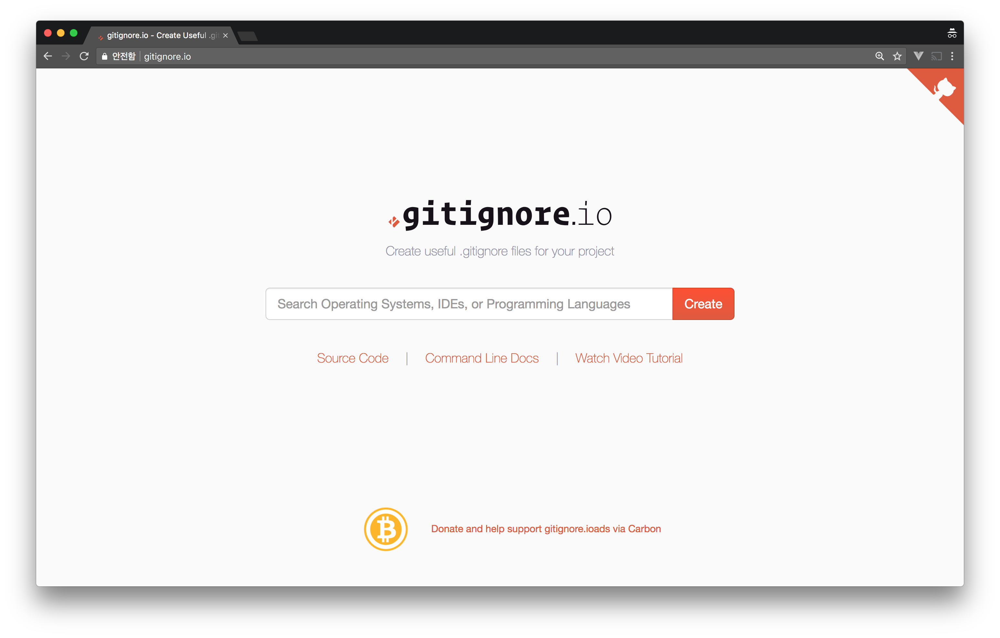
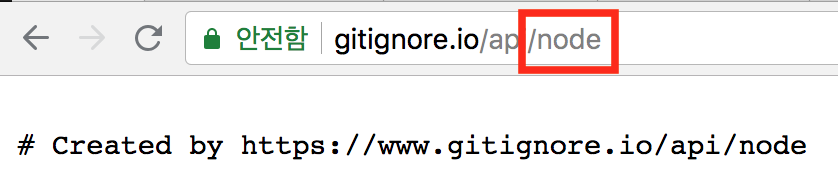
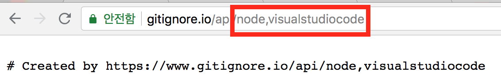
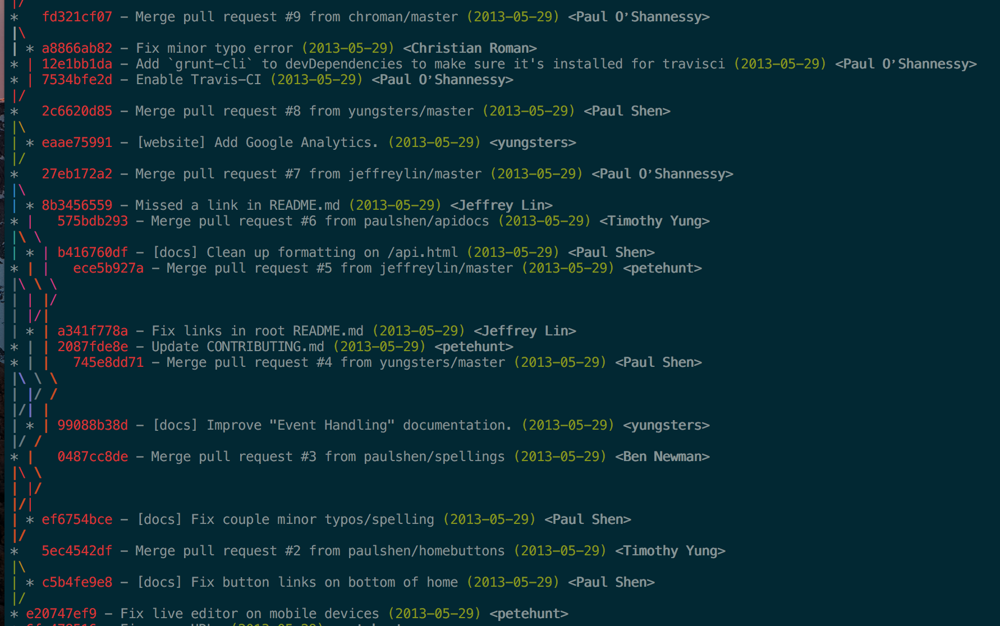

개발할때 유용하게 사용하는 bash helper function & alias 몇개를 알아보자
1. [디렉토리 만들고 바로 이동](#section)
2. [gitignore 쉽게 만들기](#gitignore--)
3. [git log 커밋 그래프 보기](#git-log---)

## 디렉토리 만들고 바로 이동
- 디렉토리를 만들고 바로 이동하기 위해서는 `mkdir`, `cd` 를 아래와 같이 쓴다.
- 아래 문제점은 쳐야할게 많고 foo가 중복되게 들어간다.

```
$ mkdir foo && cd foo
```

이런 작업들은 간편하게 하기 위해서 function을 만들어보자

```
function mkcd() {
  mkdir -p "$*" && cd "$_"
}
```

사용은 아래처럼 할 수 있다. 아까보다 중복이 줄어 들었다.

```
$ mkcd foo
```

## gitignore 쉽게 만들기
- gitignore를 terminal에서 만들기 위해서 효과적인 방법은 어떤것일까?
- 일단 gitignore에 넣을 내용을 어디서 가져올 수 있는가?
- 그런걸 제공해주는 [사이트](https://www.gitignore.io/)가 있다.



검색창에 해당하는 언어나 IDE를 입력하면 아래와 같이 처리가 된다.



빨간 네모를 친곳을 기준으로 해당 ignore 파일을 불러온다.

만약 2개라면 어떻게 나올까?



그렇다면 이 규칙을 이용해서 function을 만들 수가 있다.

```
function gi () {
  curl -L -s https://www.gitignore.io/api/$@;
}
```

사용은 아래처럼 할 수 있다.

```
$ gi node > .gitignore
$ gi node.visualstudiocode > .gitignore
```

## git log 커밋 그래프 보기
- git을 command-line으로 쓰다보면 log 볼때 github에서 보는거 같은 커밋 그래프를 볼 수 가 없다.
- 그래프를 보기 위해서는 아래와 같이 추가를 해주면 된다.

```
alias glods="git log --graph --pretty='%Cred%h%Creset -%C(yellow)%d%Creset %s %Cgreen(%ad) %C(bold blue)<%an>%Creset' --date=short"
```

그래서 해당 alias를 사용하면 아래처럼 나온다.


