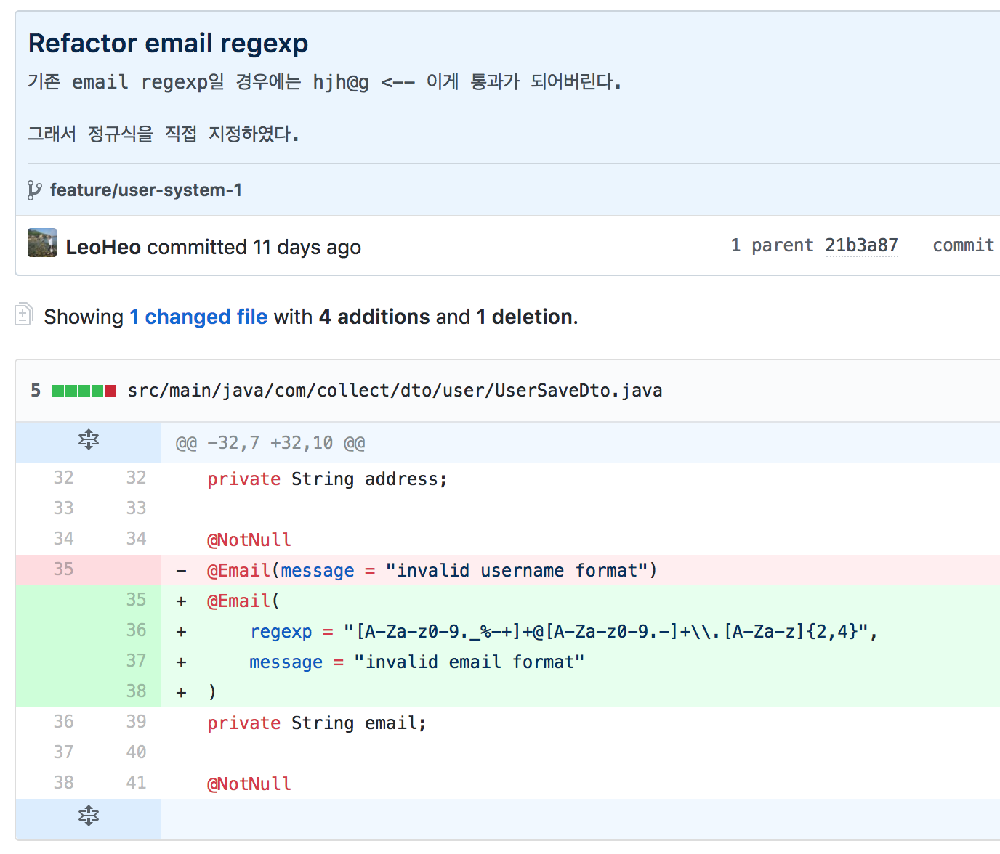

Toy project로 Spring을 공부하다가 email validation 때문에 막히는 경우가 있었습니다.

이렇게 막힐 때마다 [삽질](https://github.com/LeoHeo/collect/labels/%EC%82%BD%EC%A7%88){:target="_blank"} 라벨을 붙여서 해결했던 방법을 짧게나마 기록해놓는데 오늘은 그중에서 email validation에 대해서 글을 써볼까 합니다.

## Request Validation
Spring에서 API를 만든다고 했을 때는 Request로 넘어온 값들에 대해서 바로 Entity에 저장할 수도 있지만, 그렇게 할 경우 Core 한 Entity 부분을 건드려서 설계상 좋지 않고 Validation을 하는 코드도 지저분해지고 좋은 API라고 할 수 없습니다.

Spring API에서 Validation을 제일 깔끔하게 하는 방법을 찾다 보니 아래와 같은 방법이 제일 깔끔했습니다.

```
1. DTO를 사용하여 @Valid와 BindResult 조합으로 Error 찾기
2. 해당 에러에 대해서 @RestControllerAdvice로 예외 처리
```
<br />
위의 조합으로 회원가입 API를 만든다면 아래처럼 될 것입니다.


<br />
BadRequestException 라는 Custom Exception을 만들고 @RestControllerAdvice를 아래와 같이 구성하였습니다.


<br />
이렇게 해서 Test Code를 짜다 보니깐 잘 됩니다. ~~한가지 예외인 경우를 제외하고는~~


<br />
근데 이렇게 하고 나니깐 Email format 관련해서 한가지 이슈 사항이 생깁니다.
아래 코드가 제대로 된 Email 포맷이 아닌데 400이 아니고 201이 Return 되는 경우입니다.


<br />
제가 원하는 Email format은 `test@g.com` 같은 형태인데 `test@g` 같은 경우가 제대로 validation이 되지 않아서 email regex를 직접 지정해주게 바꾸었고 잘 작동하는 걸 확인했습니다.

[해당 커밋](https://github.com/LeoHeo/collect/commit/b1cd389ad7d4d5b21af6cea10dd057831a7dd7f8){:target="_blank"}



## 결론
- 제가 사용한 @Email은 Bean-Validation-API 2.0부터 들어간 기능입니다. 그러나 제가 못 찾는 건지 [Bean Validation](https://github.com/beanvalidation/beanvalidation-api) 레포에는 issue가 오픈되어 있지 않더군요. 그래서 Regex를 재정의하는 방식을 사용했습니다.
- Regex를 재정의하지 않고 좀 더 좋은 방법을 알고 계신다면 댓글 달아주시면 감사하겠습니다.