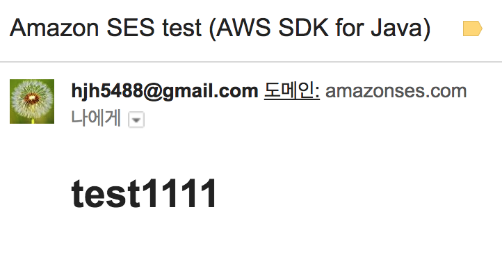

## AWS SES란? 
- AWS의 공식 설명을 보면 `비즈니스와 개발자를 위한 강력하고 고도로 확장 가능하며 경제적인 이메일 송수신 플랫폼`이라고 SES를 소개한다. 요번에 AWS SES를 사용해보면서 삽질했던 걸 정리해보고자 한다. 
- 현재 Seoul Region은 지원하지 않아서 Oregon Region을 이용하였다.

## Verify Email Address 
- AWS SES 쓸려고 한다면 Email 인증을 거쳐야 하고 Email을 많이 보내야 할 경우 Sandbox를 해제해야 한다. 
- 이 방법에 대해서는 [jojoldu님의 AWS SES (Simple Email Service) Spring Boot 프로젝트에서 사용하기](http://jojoldu.tistory.com/246){:target="_blank"} 에 잘 작성되어있으니 참고하면 좋을 거 같다.

## Configuration & Dependency
- SES 설정 방법으로는 2가지가 있다.
1. default로 `~/.aws/credentials`의 `[default]` profile을 참고하는 방법
2. application.yml or application.properties를 참고하는 방법

여기서는 2번째 방법에 대해서 알아보고자 한다.
설정파일과 의존성을 아래와 같이 추가해준다.



위의 Code를 잘 보면 `AmazonSimpleEmailServiceAsync`를 사용하고 있다.

AWS SDK SES가 제공하는 Class에는 2가지가 있다.
1. AmazonSimpleEmailService
2. AmazonSimpleEmailServiceAsync

AmazonSimpleEmailServiceAsync는 AmazonSimpleEmailService를 상속받아서 사용하는 class이다.

그렇다면 왜 AmazonSimpleEmailServiceAsync를 사용했을까?

예를 들어서 설명을 해보겠다. 
회원가입을 하고 나면 축하 Email을 보낸다고 가정해보자. 

1. front에서 홍길동이라는 사람이 회원가입 request를 보낸다. 
2. request를 받은 API는 users 테이블에 홍길동 정보를 저장한다. 
3. Email을 보내고 response를 한다.

### Sync 일 경우 문제점
1. front-end에서 response 받기까지 상당히 오랜 시간이 걸린다.
2. 서비스가 잘돼서 회원가입을 하는 사람이 많아지면 대규모 트래픽에 대응하기가 어렵다.

이런 이유로 AmazonSimpleEmailServiceAsync를 사용했다.

## AWS SES Example
- [AWS 예제문서](https://docs.aws.amazon.com/ko_kr/ses/latest/DeveloperGuide/examples-send-using-sdk.html){:target="_blank"}에 나오는 예제를 참고하여 작성해보면 아래와 같은 코드가 나온다.



## AWS SES Utils
위의 코드에서 문제점은 무엇일까?
1. HTML을 HTMLBODY처럼 raw string으로 만드는건 비효율적이다.
2. SendEmailRequest 부분이 너무 비효율적이다.

좀 더 사용성이 좋게 Refactoring을 해보자.
HTML 파일을 사용해서 HTMLBODY를 만들 수는 없을까?
인스턴스 생성이 너무 많으니 관련된 Factory method를 만들 수는 없을까?

이런 생각을 하고 코드를 리팩토링 하다가 우연하게 [AWS SDK Java v2](https://github.com/aws/aws-sdk-java-v2){:target="_blank"}를 발견하게 된다.

[AWS SDK v2에 추가된 새로운 기능](https://aws.amazon.com/ko/blogs/developer/aws-sdk-for-java-2-0-developer-preview/){:target="_blank"}중에 2가지가 맘에 들어서 사용해보기로 했다.
1. Non-blocking I/O
2. Client Builders



그래서 위와 같은 AwsSesUtils Component를 생성한다.

이 Component는 2개의 class를 DI 받는데

1. html 파일을 이용해서 email body를 채우기 위해서 thymeleaf의 SpringTemplateEngine
2. AWS SDK v2에서 바뀐 SESAsyncClient

이렇게 리팩토링 된 AwsSesUtils 사용하기 위해서 바뀌어야 하는 Configuration과 Dependency를 알아보고 UserService에서 사용법을 살펴보자.



 
그러고 나서 이메일을 보내면 아래와 같이 정상적으로 보내짐을 확인 할 수 있다.

## 결론
지금까지 Spring AWS SES 사용법에 살펴봤다.

1. AWS SES의 Client를 Async, Sync 차이점
2. SDK 1과 2를 비교해봤고 SDK 2의 Builder 패턴들을 소개
3. AwsSesUtils Component를 만들어서 편리한 방법 소개

P.S 이글을 보시는 분 중에 틀린 점을 발견하셨다면 지적 부탁드립니다.

